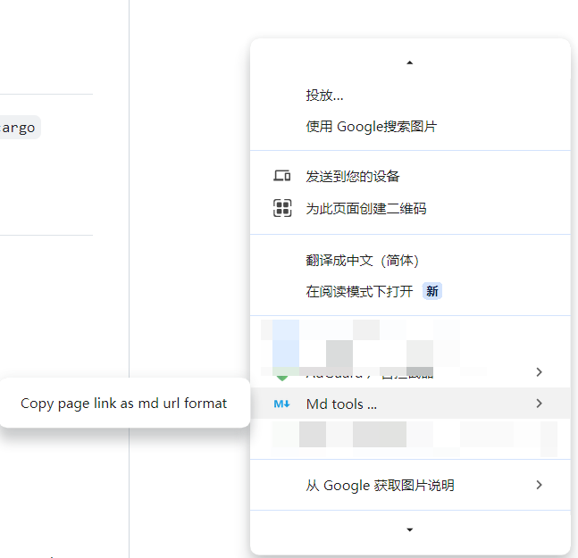
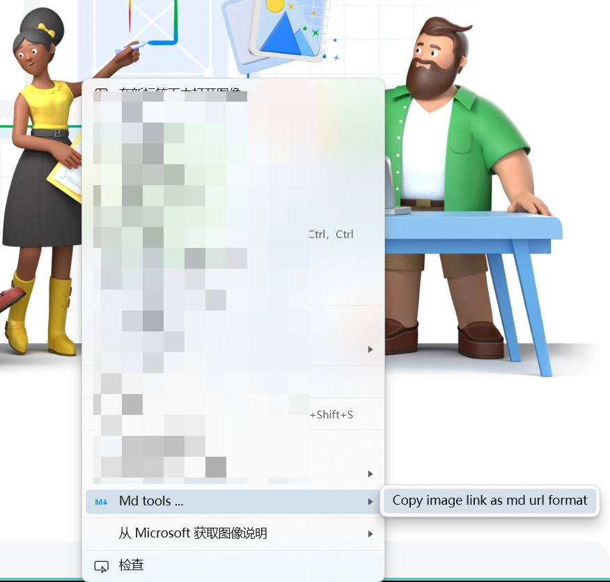

# Markdown Tools

A markdown tool for web , make your writing more convenient .

## Using

Not released yet, so please download and install manually .

Clone or download this repo, and choose the inner `markdown-tools` to load in chrome or edge .

### copy page url

with context menu

with keyboard shortcuts

`Alt + M`

### copy img url

*Firefox is not currently supported.*

## Features

- copy page url to clipboard as `[title](link)` format
- copy selected image url to clipboard as `` format

## Roadmap
- [x] keyboard shortcuts
- [ ] User customize shortcut keys
- [ ] Add notifications after copy
- [ ] Copy tables from the web page